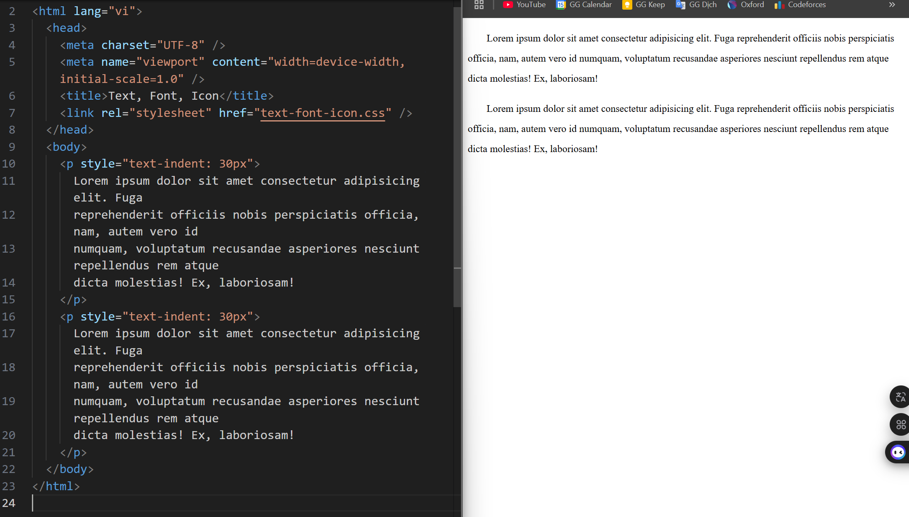

# Buổi 2. Phần 1: CSS cơ bản

- [Buổi 2. Phần 1: CSS cơ bản](#buổi-2-phần-1-css-cơ-bản)
  - [A. Khái niệm, cú pháp, selectors](#a-khái-niệm-cú-pháp-selectors)
    - [I. Khái niệm về CSS](#i-khái-niệm-về-css)
      - [1. CSS là gì?](#1-css-là-gì)
        - [🔍 Ghi chú SEO:](#-ghi-chú-seo)
    - [II. Cú pháp CSS](#ii-cú-pháp-css)
      - [1. Cấu trúc cơ bản](#1-cấu-trúc-cơ-bản)
      - [2. Ghi chú trong CSS](#2-ghi-chú-trong-css)
    - [III. Các cách nhúng CSS vào HTML](#iii-các-cách-nhúng-css-vào-html)
      - [1. Inline CSS (trong thẻ HTML)](#1-inline-css-trong-thẻ-html)
        - [❌ SEO \& Performance:](#-seo--performance)
      - [2. Internal CSS (trong thẻ `<style>`)](#2-internal-css-trong-thẻ-style)
      - [3. External CSS (file `.css` riêng biệt – cách tốt nhất)](#3-external-css-file-css-riêng-biệt--cách-tốt-nhất)
        - [✅ SEO \& Performance:](#-seo--performance-1)
    - [IV. Selectors (Bộ chọn)](#iv-selectors-bộ-chọn)
      - [1. Selector cơ bản](#1-selector-cơ-bản)
        - [🔍 SEO:](#-seo)
      - [2. Combinator Selectors (Selectors kết hợp)](#2-combinator-selectors-selectors-kết-hợp)
    - [V. BEM](#v-bem)
      - [1. BEM là gì?](#1-bem-là-gì)
      - [2. Cấu trúc tên class theo BEM](#2-cấu-trúc-tên-class-theo-bem)
      - [3. Ví dụ cụ thể](#3-ví-dụ-cụ-thể)
        - [a. Ví dụ với block và modifier:](#a-ví-dụ-với-block-và-modifier)
        - [b. Ví dụ với block và element:](#b-ví-dụ-với-block-và-element)
        - [c. Element + modifier:](#c-element--modifier)
      - [4. Quy tắc đặt tên trong BEM](#4-quy-tắc-đặt-tên-trong-bem)
      - [5. Ưu điểm của BEM](#5-ưu-điểm-của-bem)
      - [6. So sánh BEM vs cách đặt tên không tổ chức](#6-so-sánh-bem-vs-cách-đặt-tên-không-tổ-chức)
      - [7. BEM ảnh hưởng đến SEO không?](#7-bem-ảnh-hưởng-đến-seo-không)
      - [8. Lưu ý khi áp dụng BEM](#8-lưu-ý-khi-áp-dụng-bem)
    - [VI. Cách viết CSS tốt (Best Practices)](#vi-cách-viết-css-tốt-best-practices)
      - [1. Ưu tiên dùng class thay vì ID](#1-ưu-tiên-dùng-class-thay-vì-id)
      - [2. Tránh !important trừ khi cần thiết](#2-tránh-important-trừ-khi-cần-thiết)
      - [3. Ghi chú rõ ràng](#3-ghi-chú-rõ-ràng)
  - [B. 3 kiểu chèn CSS](#b-3-kiểu-chèn-css)
    - [I. Tổng quan](#i-tổng-quan)
    - [II. Inline CSS](#ii-inline-css)
      - [1. Cú pháp](#1-cú-pháp)
      - [2. Ưu điểm](#2-ưu-điểm)
      - [3. Nhược điểm](#3-nhược-điểm)
    - [III. Internal CSS (CSS nội bộ)](#iii-internal-css-css-nội-bộ)
      - [1. Cú pháp](#1-cú-pháp-1)
      - [2. Ưu điểm](#2-ưu-điểm-1)
      - [3. Nhược điểm](#3-nhược-điểm-1)
    - [IV. External CSS (CSS bên ngoài – tách file `.css`)](#iv-external-css-css-bên-ngoài--tách-file-css)
      - [1. Cú pháp](#1-cú-pháp-2)
      - [2. Ưu điểm](#2-ưu-điểm-2)
      - [3. Nhược điểm](#3-nhược-điểm-2)
    - [VI. Thực tế khi đi làm](#vi-thực-tế-khi-đi-làm)
  - [C. Colors, Backgrounds, Height, Width](#c-colors-backgrounds-height-width)
    - [I. Colors (Màu sắc)](#i-colors-màu-sắc)
      - [1. Các cách khai báo màu trong CSS](#1-các-cách-khai-báo-màu-trong-css)
        - [💡 Mẹo:](#-mẹo)
      - [2. Thuộc tính liên quan đến màu](#2-thuộc-tính-liên-quan-đến-màu)
      - [3. Code ví dụ](#3-code-ví-dụ)
    - [II. Backgrounds (Nền)](#ii-backgrounds-nền)
      - [1. `background-color`](#1-background-color)
      - [2. `background-image`](#2-background-image)
        - [a. Kết hợp nhiều ảnh nền](#a-kết-hợp-nhiều-ảnh-nền)
        - [b. Màu gradient](#b-màu-gradient)
      - [3. `background-repeat`](#3-background-repeat)
      - [4. `background-position`](#4-background-position)
      - [5. `background-size`](#5-background-size)
      - [6. `background-attachment`](#6-background-attachment)
      - [7. `background` (viết gộp)](#7-background-viết-gộp)
      - [8. Code ví dụ](#8-code-ví-dụ)
    - [III. Height \& Width (Chiều cao \& rộng)](#iii-height--width-chiều-cao--rộng)
      - [1. Đơn vị thường dùng](#1-đơn-vị-thường-dùng)
        - [📌 Ghi chú SEO:](#-ghi-chú-seo-1)
      - [2. Thiết lập chiều rộng](#2-thiết-lập-chiều-rộng)
      - [3. Thiết lập chiều cao](#3-thiết-lập-chiều-cao)
      - [4. `min-width`, `max-width`, `min-height`, `max-height`](#4-min-width-max-width-min-height-max-height)
    - [IV. Tóm tắt khi làm dự án](#iv-tóm-tắt-khi-làm-dự-án)
  - [D. Box Model, Borders, Padding, Margins](#d-box-model-borders-padding-margins)
    - [I. Box Model là gì?](#i-box-model-là-gì)
      - [1. Khái niệm](#1-khái-niệm)
      - [2. Các thành phần](#2-các-thành-phần)
    - [II. Padding – Khoảng cách giữa **nội dung và viền**](#ii-padding--khoảng-cách-giữa-nội-dung-và-viền)
      - [1. Cú pháp cơ bản](#1-cú-pháp-cơ-bản)
    - [III. Border – Viền](#iii-border--viền)
      - [1. Cú pháp cơ bản](#1-cú-pháp-cơ-bản-1)
      - [2. Viết riêng từng cạnh](#2-viết-riêng-từng-cạnh)
      - [3. Bo góc viền – `border-radius`](#3-bo-góc-viền--border-radius)
        - [📌 Thực tế:](#-thực-tế)
    - [IV. Margin – Khoảng cách giữa phần tử với phần tử khác](#iv-margin--khoảng-cách-giữa-phần-tử-với-phần-tử-khác)
      - [1. Cách sử dụng](#1-cách-sử-dụng)
      - [2. Tự động căn giữa – `margin: auto`](#2-tự-động-căn-giữa--margin-auto)
      - [3. Negative margin (margin âm)](#3-negative-margin-margin-âm)
      - [4. Collapsing Margin (gộp margin)](#4-collapsing-margin-gộp-margin)
    - [V. `box-sizing` – Cách tính kích thước hộp](#v-box-sizing--cách-tính-kích-thước-hộp)
      - [1. Mặc định: `box-sizing: content-box;`](#1-mặc-định-box-sizing-content-box)
      - [2. Cách nên dùng: `box-sizing: border-box;`](#2-cách-nên-dùng-box-sizing-border-box)
        - [✅ Best Practice:](#-best-practice)
    - [VI. Ghi chú cho SEO \& UX](#vi-ghi-chú-cho-seo--ux)
    - [VII. Code ví dụ tổng hợp](#vii-code-ví-dụ-tổng-hợp)
  - [E. Text, Fonts, Icons](#e-text-fonts-icons)
    - [I. Text](#i-text)
      - [1. `color` – Màu chữ](#1-color--màu-chữ)
        - [🔍 Ghi chú SEO:](#-ghi-chú-seo-2)
      - [2. `text-align` – Căn lề chữ](#2-text-align--căn-lề-chữ)
      - [3. `text-transform` – Kiểu chữ hoa/thường](#3-text-transform--kiểu-chữ-hoathường)
      - [4. `text-decoration` – Trang trí chữ](#4-text-decoration--trang-trí-chữ)
        - [Demo:](#demo)
      - [5. `text-indent` – Thụt đầu dòng](#5-text-indent--thụt-đầu-dòng)
        - [Ví dụ:](#ví-dụ)
      - [6. `line-height` – Chiều cao dòng](#6-line-height--chiều-cao-dòng)
        - [Lưu ý thực tế:](#lưu-ý-thực-tế)
    - [II. Fonts](#ii-fonts)
      - [1. `font-family` – Font chữ](#1-font-family--font-chữ)
        - [📌 Lưu ý:](#-lưu-ý)
      - [2. Import font từ Google Fonts](#2-import-font-từ-google-fonts)
        - [Cách 1: Dùng `<link>` trong HTML](#cách-1-dùng-link-trong-html)
        - [Note:](#note)
        - [Cách 2: Dùng `@import` trong CSS (chậm hơn, kém tối ưu)](#cách-2-dùng-import-trong-css-chậm-hơn-kém-tối-ưu)
        - [🔍 SEO \& Performance:](#-seo--performance-2)
      - [3. `@font-face`](#3-font-face)
        - [Cú pháp:](#cú-pháp)
        - [Giải thích các thuộc tính:](#giải-thích-các-thuộc-tính)
      - [✅ Cách sử dụng](#-cách-sử-dụng)
      - [🔍 SEO \& Performance](#-seo--performance-3)
      - [4. `font-size` – Cỡ chữ](#4-font-size--cỡ-chữ)
      - [5. `font-weight` – Độ đậm](#5-font-weight--độ-đậm)
      - [6. `font-style` – Kiểu nghiêng](#6-font-style--kiểu-nghiêng)
    - [III. Icons](#iii-icons)
      - [1. Dùng font-icon: **Font Awesome** (rất phổ biến)](#1-dùng-font-icon-font-awesome-rất-phổ-biến)
        - [a. Thêm vào HTML (copy từ trang: https://cdnjs.com/libraries/font-awesome):](#a-thêm-vào-html-copy-từ-trang-httpscdnjscomlibrariesfont-awesome)
        - [b. Dùng trong HTML:](#b-dùng-trong-html)
      - [2. Dùng SVG icons (hiện đại hơn, hiệu suất tốt hơn)](#2-dùng-svg-icons-hiện-đại-hơn-hiệu-suất-tốt-hơn)
        - [Ví dụ:](#ví-dụ-1)
        - [✅ Ưu điểm:](#-ưu-điểm)
  - [F. List, Table](#f-list-table)
    - [I. List](#i-list)
      - [1. Các thuộc tính CSS cho danh sách](#1-các-thuộc-tính-css-cho-danh-sách)
        - [a. `list-style-type`](#a-list-style-type)
        - [b. `list-style-image`](#b-list-style-image)
        - [c. `list-style-position`](#c-list-style-position)
        - [d. Rút gọn với `list-style`](#d-rút-gọn-với-list-style)
    - [II. Table](#ii-table)
      - [1. Thuộc tính CSS thường dùng cho bảng](#1-thuộc-tính-css-thường-dùng-cho-bảng)
        - [a. `border`](#a-border)
        - [b. `border-collapse`](#b-border-collapse)
        - [c. `width`, `height`](#c-width-height)
        - [d. `text-align`, `vertical-align`](#d-text-align-vertical-align)
        - [e. `padding`](#e-padding)
  - [G. Display (inline, block, inline-block, none)](#g-display-inline-block-inline-block-none)
    - [I. `display` là gì?](#i-display-là-gì)
    - [II. Các giá trị hiển thị phổ biến](#ii-các-giá-trị-hiển-thị-phổ-biến)
      - [1. `display: block`](#1-display-block)
        - [Đặc điểm:](#đặc-điểm)
      - [2. `display: inline`](#2-display-inline)
        - [Đặc điểm:](#đặc-điểm-1)
      - [3. `display: inline-block`](#3-display-inline-block)
        - [Đặc điểm:](#đặc-điểm-2)
      - [4. `display: none`](#4-display-none)
        - [Đặc điểm:](#đặc-điểm-3)
        - [Ví dụ:](#ví-dụ-2)
    - [III. Phân biệt `display: none` vs `visibility: hidden`](#iii-phân-biệt-display-none-vs-visibility-hidden)
        - [Ví dụ:](#ví-dụ-3)
    - [IV. Ứng dụng thực tế](#iv-ứng-dụng-thực-tế)
  - [H. Position trong CSS](#h-position-trong-css)
    - [I. Tổng quan về `position`](#i-tổng-quan-về-position)
    - [II. Các loại `position` trong CSS](#ii-các-loại-position-trong-css)
      - [1. `position: static` (Mặc định)](#1-position-static-mặc-định)
        - [✔️ Đặc điểm:](#️-đặc-điểm)
      - [2. `position: relative`](#2-position-relative)
        - [✔️ Đặc điểm:](#️-đặc-điểm-1)
        - [Ví dụ:](#ví-dụ-4)
      - [3. `position: absolute`](#3-position-absolute)
        - [✔️ Đặc điểm:](#️-đặc-điểm-2)
        - [Ví dụ:](#ví-dụ-5)
      - [4. `position: fixed`](#4-position-fixed)
        - [✔️ Đặc điểm:](#️-đặc-điểm-3)
        - [Ví dụ:](#ví-dụ-6)
      - [5. `position: sticky`](#5-position-sticky)
        - [✔️ Đặc điểm:](#️-đặc-điểm-4)
        - [Ví dụ:](#ví-dụ-7)
    - [III. So sánh các loại `position`](#iii-so-sánh-các-loại-position)
    - [IV. ✅ Ứng dụng thực tế](#iv--ứng-dụng-thực-tế)
  - [I. Z-index, Overflow, Opacity](#i-z-index-overflow-opacity)
    - [I. Z-INDEX – Kiểm soát thứ tự chồng lớp](#i-z-index--kiểm-soát-thứ-tự-chồng-lớp)
      - [1. Khái niệm](#1-khái-niệm-1)
      - [2. Cú pháp](#2-cú-pháp)
      - [3. Điều kiện để `z-index` hoạt động:](#3-điều-kiện-để-z-index-hoạt-động)
      - [4. Ví dụ](#4-ví-dụ)
      - [5. Lưu ý nâng cao](#5-lưu-ý-nâng-cao)
      - [✅ Ứng dụng thực tế](#-ứng-dụng-thực-tế)
    - [II. OVERFLOW – Xử lý nội dung tràn](#ii-overflow--xử-lý-nội-dung-tràn)
      - [1. Khái niệm](#1-khái-niệm-2)
      - [2. Cú pháp](#2-cú-pháp-1)
      - [3. Các giá trị](#3-các-giá-trị)
      - [4. overflow-x (chiều ngang), overflow-y (chiều dọc)](#4-overflow-x-chiều-ngang-overflow-y-chiều-dọc)
      - [UX:](#ux)
    - [III. OPACITY – Độ mờ trong CSS](#iii-opacity--độ-mờ-trong-css)
      - [1. Khái niệm](#1-khái-niệm-3)
      - [2. Cú pháp](#2-cú-pháp-2)
      - [3. Ví dụ](#3-ví-dụ)
      - [4. Hiệu ứng nâng cao](#4-hiệu-ứng-nâng-cao)
      - [5. ❗ Lưu ý](#5--lưu-ý)
  - [**J. Pseudo-Classes (Lớp giả)**](#j-pseudo-classes-lớp-giả)
    - [I. Khái niệm](#i-khái-niệm)
    - [II. Cấu trúc cú pháp](#ii-cấu-trúc-cú-pháp)
        - [Ví dụ:](#ví-dụ-8)
    - [III. Các pseudo-class thường dùng (rất quan trọng)](#iii-các-pseudo-class-thường-dùng-rất-quan-trọng)
      - [1. **:hover**](#1-hover)
      - [2. **:active**](#2-active)
      - [3. **:focus**](#3-focus)
      - [4. **:visited**](#4-visited)
    - [IV. Pseudo-class trạng thái trong biểu mẫu](#iv-pseudo-class-trạng-thái-trong-biểu-mẫu)
      - [1. **:checked**](#1-checked)
      - [2. **:disabled** và **:enabled**](#2-disabled-và-enabled)
      - [3. **:required** và **:optional**](#3-required-và-optional)
    - [V. Pseudo-class vị trí trong DOM](#v-pseudo-class-vị-trí-trong-dom)
      - [1. **:first-child** / **:last-child**](#1-first-child--last-child)
      - [2. **:nth-child(n)** / **:nth-last-child(n)**](#2-nth-childn--nth-last-childn)
    - [VI. Các pseudo-class khác hữu dụng](#vi-các-pseudo-class-khác-hữu-dụng)
      - [1. **:not(selector)**](#1-notselector)
      - [2. **:empty**](#2-empty)
    - [VII. 🔍 Gợi ý SEO \& UX](#vii--gợi-ý-seo--ux)
    - [VIII. Tóm tắt](#viii-tóm-tắt)
  - [**K. Pseudo-Elements (Phần tử giả)**](#k-pseudo-elements-phần-tử-giả)
    - [I. Khái niệm](#i-khái-niệm-1)
    - [II. Cú pháp chung](#ii-cú-pháp-chung)
    - [III. Các pseudo-element phổ biến nhất](#iii-các-pseudo-element-phổ-biến-nhất)
      - [1. `::before`](#1-before)
      - [2. `::after`](#2-after)
      - [3. `::first-line`](#3-first-line)
      - [4. `::first-letter`](#4-first-letter)
      - [5. `::selection`](#5-selection)
        - [Lưu ý:](#lưu-ý)
  - [**L. Relative \& Absolute Units (Đơn vị tương đối \& tuyệt đối)**](#l-relative--absolute-units-đơn-vị-tương-đối--tuyệt-đối)
    - [I. Tổng quan](#i-tổng-quan-1)
    - [II. Absolute Units (Đơn vị tuyệt đối)](#ii-absolute-units-đơn-vị-tuyệt-đối)
    - [III. Relative Units (Đơn vị tương đối)](#iii-relative-units-đơn-vị-tương-đối)
      - [1. `em`](#1-em)
      - [2. `rem` (root em)](#2-rem-root-em)
      - [3. `%` (phần trăm)](#3--phần-trăm)
      - [4. `vw` / `vh` / `vmin` / `vmax`](#4-vw--vh--vmin--vmax)
      - [5. `ch`, `ex`](#5-ch-ex)
    - [IV. So sánh nhanh: rem vs em vs px](#iv-so-sánh-nhanh-rem-vs-em-vs-px)
    - [V. Khi nào nên dùng gì?](#v-khi-nào-nên-dùng-gì)
    - [VI. SEO \& Performance](#vi-seo--performance)
  - [**M. `!important` trong CSS**](#m-important-trong-css)
    - [I. Khái niệm](#i-khái-niệm-2)
    - [II. Cú pháp](#ii-cú-pháp)
    - [III. Khi nào nên dùng `!important`](#iii-khi-nào-nên-dùng-important)
    - [IV. Lạm dụng `!important` gây hại gì?](#iv-lạm-dụng-important-gây-hại-gì)
  - [N. CSS Math Functions (Hàm toán học)](#n-css-math-functions-hàm-toán-học)
    - [I. Tổng quan](#i-tổng-quan-2)
    - [II. Các hàm toán học chính](#ii-các-hàm-toán-học-chính)
      - [1. `calc()`](#1-calc)
        - [✅ Mô tả:](#-mô-tả)
        - [✅ Cú pháp:](#-cú-pháp)
        - [📌 Ví dụ:](#-ví-dụ)
        - [🔍 Lưu ý:](#-lưu-ý-1)
      - [2. `min()`](#2-min)
        - [✅ Mô tả:](#-mô-tả-1)
        - [📌 Ví dụ:](#-ví-dụ-1)
      - [3. `max()`](#3-max)
        - [✅ Mô tả:](#-mô-tả-2)
        - [📌 Ví dụ:](#-ví-dụ-2)
      - [4. `clamp()`](#4-clamp)
        - [✅ Mô tả:](#-mô-tả-3)
        - [✅ Cú pháp:](#-cú-pháp-1)
        - [📌 Ví dụ:](#-ví-dụ-3)
    - [III. So sánh nhanh](#iii-so-sánh-nhanh)
  - [O. CSS Variables, Box Sizing, Reset CSS](#o-css-variables-box-sizing-reset-css)
    - [I. CSS Variables (Biến trong CSS)](#i-css-variables-biến-trong-css)
      - [1. Khái niệm](#1-khái-niệm-4)
      - [2. Cú pháp](#2-cú-pháp-3)
        - [Sử dụng:](#sử-dụng)
      - [3. Đặc điểm](#3-đặc-điểm)
      - [4. Ví dụ](#4-ví-dụ-1)
    - [II. `box-sizing`](#ii-box-sizing)
      - [1. Khái niệm](#1-khái-niệm-5)
      - [2. Các giá trị](#2-các-giá-trị)
        - [Lý do nên dùng `border-box`](#lý-do-nên-dùng-border-box)
    - [III. Reset CSS / Normalize CSS](#iii-reset-css--normalize-css)
      - [1. Vấn đề](#1-vấn-đề)
      - [2. Giải pháp: Reset CSS](#2-giải-pháp-reset-css)
      - [3. Ví dụ đơn giản](#3-ví-dụ-đơn-giản)
      - [4. Normalize CSS](#4-normalize-css)
      - [5. Khác biệt giữa Normalize CSS và Reset CSS](#5-khác-biệt-giữa-normalize-css-và-reset-css)


## A. Khái niệm, cú pháp, selectors

### I. Khái niệm về CSS

#### 1. CSS là gì?

CSS (Cascading Style Sheets) là ngôn ngữ định kiểu cho HTML. Nó giúp bạn kiểm soát:

* Màu sắc
* Kích thước
* Khoảng cách
* Bố cục
* Font chữ
* Hiệu ứng (animation, transition)
* Responsive (hiển thị trên nhiều thiết bị)

##### 🔍 Ghi chú SEO:

Việc dùng CSS giúp **giảm inline style** trong HTML → **tăng độ dễ đọc cho trình thu thập (crawler)** → hỗ trợ SEO tốt hơn.

---

### II. Cú pháp CSS

#### 1. Cấu trúc cơ bản

```css
selector {
  property: value;
}
```

Ví dụ:

```css
h1 {
  color: blue;
  font-size: 24px;
}
```

**Giải thích**:

| Thành phần | Mô tả                                          |
| ---------- | ---------------------------------------------- |
| `selector` | Phần tử HTML bạn muốn áp dụng CSS              |
| `property` | Thuộc tính cần chỉnh (ví dụ: color, font-size) |
| `value`    | Giá trị gán cho thuộc tính                     |

#### 2. Ghi chú trong CSS

```css
/* Đây là một ghi chú */
```

---

### III. Selectors (Bộ chọn)

#### 1. Selector cơ bản

| Selector     | Mô tả             | Ví dụ                      |
| ------------ | ----------------- | -------------------------- |
| `*`          | Tất cả phần tử    | `* { margin: 0; }`         |
| `element`    | Chọn theo tên thẻ | `p {}`                     |
| `.class`     | Chọn theo class   | `.note {}`                 |
| `#id`        | Chọn theo id      | `#main {}`                 |
| `A, B, C...` | Bộ chọn theo nhóm | `h1, h2, p { margin: 0; }` |

##### 🔍 SEO:

Dùng `id` quá nhiều có thể gây **kém tái sử dụng**, nên ưu tiên dùng `class`.

#### 2. Combinator Selectors (Selectors kết hợp)

| Selector  | Mô tả                                    | Ví dụ        |
| --------- | ---------------------------------------- | ------------ |
| `div p`   | Chọn `<p>` nằm trong `<div>`             | `div p {}`   |
| `div > p` | `<p>` là **con trực tiếp** của `<div>`   | `div > p {}` |
| `h1 + p`  | `<p>` ngay **sau** `h1` (anh em kế tiếp) | `h1 + p {}`  |
| `h1 ~ p`  | **Tất cả** `<p>` sau `h1` (cùng cấp)     | `h1 ~ p {}`  |

---

### IV. BEM

#### 1. BEM là gì?

**BEM** là viết tắt của:

> **B**lock – **E**lement – **M**odifier

Đây là một **phương pháp đặt tên class** trong CSS giúp mã nguồn:

* Có cấu trúc rõ ràng
* Dễ tái sử dụng
* Tránh xung đột tên class
* Dễ mở rộng và bảo trì (đặc biệt trong dự án lớn hoặc làm việc nhóm)

#### 2. Cấu trúc tên class theo BEM

```plaintext
.block__element--modifier
```

| Thành phần | Ý nghĩa                                                             |
| ---------- | ------------------------------------------------------------------- |
| `block`    | Thành phần độc lập (ví dụ: form, button, nav)                       |
| `element`  | Phần tử con của block, không dùng riêng được                        |
| `modifier` | Phiên bản khác nhau về giao diện hoặc trạng thái (ví dụ: màu, size) |

#### 3. Ví dụ cụ thể

##### a. Ví dụ với block và modifier:

```html
<button class="button">Gửi</button>
<button class="button button--danger">Xóa</button>
```

```css
.button {
  background-color: blue;
  color: white;
}
.button--danger {
  background-color: red;
}
```

##### b. Ví dụ với block và element:

```html
<div class="card">
  <h2 class="card__title">Tiêu đề</h2>
  <p class="card__content">Đây là nội dung của thẻ card.</p>
</div>
```

```css
.card {
  border: 1px solid #ccc;
  padding: 20px;
}
.card__title {
  font-size: 20px;
}
.card__content {
  font-size: 16px;
}
```

##### c. Element + modifier:

```html
<h2 class="card__title card__title--highlight">Tiêu đề nổi bật</h2>
```

```css
.card__title--highlight {
  color: red;
}
```

#### 4. Quy tắc đặt tên trong BEM

| Quy tắc                        | Mô tả & Ví dụ                                             |
| ------------------------------ | --------------------------------------------------------- |
| **Block**                      | Tên riêng biệt: `button`, `nav`, `form`                   |
| **Element** (dùng `__`)        | `card__title`, `form__label`                              |
| **Modifier** (dùng `--`)       | `button--large`, `title--highlight`                       |
| **Không viết hoa**             | Viết thường, nối bằng gạch ngang (`-`)                    |
| **Không dùng class lồng nhau** | Tránh `.card .card__title`, chỉ dùng `.card__title` là đủ |

#### 5. Ưu điểm của BEM

| Ưu điểm                | Lý do                                                   |
| ---------------------- | ------------------------------------------------------- |
| ✅ Tổ chức mã rõ ràng   | Nhìn tên class là biết nó nằm trong block nào           |
| ✅ Dễ bảo trì & mở rộng | Thêm mới hoặc thay đổi không ảnh hưởng các phần tử khác |
| ✅ Tránh xung đột       | Không bị trùng tên class với phần khác                  |
| ✅ Hợp tác nhóm tốt hơn | Dễ đọc và thống nhất giữa nhiều lập trình viên          |

#### 6. So sánh BEM vs cách đặt tên không tổ chức

| ❌ Không có tổ chức (cũ)         | ✅ Theo BEM                          |
| ------------------------------- | ----------------------------------- |
| `.title`, `.danger`, `.box`     | `.card__title`, `.button--danger`   |
| Dễ trùng, khó tái sử dụng       | Rõ ràng, có "namespace" (block)     |
| Không biết quan hệ giữa phần tử | Hiểu rõ phần tử con thuộc block nào |

#### 7. BEM ảnh hưởng đến SEO không?

> ⚠️ **Không ảnh hưởng trực tiếp**, nhưng **ảnh hưởng gián tiếp tốt**:

* Giao diện có cấu trúc tốt → dễ viết HTML semantic → **tăng khả năng hiểu của crawler**
* Tránh lỗi đè CSS → giao diện hiển thị đúng → **trải nghiệm người dùng tốt hơn**
* Gọn gàng → dễ áp dụng Schema Markup, tăng điểm SEO kỹ thuật

#### 8. Lưu ý khi áp dụng BEM

* Không nhất thiết phải dùng **mọi lúc**, nhưng dùng trong các thành phần UI tái sử dụng là rất tốt (button, card, form,...)
* Có thể kết hợp với framework (Bootstrap, Tailwind) bằng cách tạo wrapper class theo BEM
* Có thể tùy chỉnh theo quy tắc nội bộ team

---

### V. Cách viết CSS tốt (Best Practices)

#### 1. Ưu tiên dùng class thay vì ID

* `class` có thể dùng nhiều lần, dễ tái sử dụng
* `id` chỉ dùng được cho một phần tử **duy nhất**

#### 2. Tránh !important trừ khi cần thiết

```css
/* Tạm thời override */
.button {
  background-color: red !important;
}
```

#### 3. Ghi chú rõ ràng

```css
/* Layout chính */
.container {
  width: 100%;
}
```

---
---

## B. 3 kiểu chèn CSS

### I. Tổng quan

CSS có thể được chèn vào tài liệu HTML theo **3 cách chính**, mỗi cách có ưu và nhược điểm riêng:

| Kiểu chèn    | Vị trí                   | Mức ưu tiên (specificity) | Ghi chú SEO & Performance              |
| ------------ | ------------------------ | ------------------------- | -------------------------------------- |
| Inline CSS   | Trực tiếp trong thẻ HTML | **Cao nhất**              | ❌ Không nên dùng nhiều – ảnh hưởng SEO |
| Internal CSS | Trong thẻ `<style>`      | Trung bình                | ✅ Tốt cho dự án nhỏ                    |
| External CSS | File `.css` riêng biệt   | **Tốt nhất về tổ chức**   | ✅ Tối ưu SEO và hiệu suất              |

---

### II. Inline CSS

#### 1. Cú pháp

CSS được viết trực tiếp trong thuộc tính `style` của thẻ HTML.

```html
<p style="color: red; font-size: 20px;">Hello World</p>
```

#### 2. Ưu điểm

* Nhanh chóng, đơn giản để test hoặc override nhanh.
* Không cần thêm file ngoài.

#### 3. Nhược điểm

* **Tái sử dụng kém** – lặp đi lặp lại ở nhiều thẻ.
* Gây **khó bảo trì** và **khó đọc mã**.
* **Không tận dụng được caching** của trình duyệt.
* ❌ **Ảnh hưởng SEO**: làm HTML rối, tăng kích thước trang → crawler khó phân tích cấu trúc → giảm điểm SEO.

---

### III. Internal CSS (CSS nội bộ)

#### 1. Cú pháp

CSS được đặt trong thẻ `<style>` bên trong `<head>` của HTML.

```html
<!DOCTYPE html>
<html>
<head>
  <style>
    h1 {
      color: white;
      background-color: black;
      text-align: center;
    }
  </style>
</head>
<body>
  <h1>Hoàng Văn Chính</h1>
</body>
</html>
```

#### 2. Ưu điểm

* Gọn gàng hơn so với inline.
* Phù hợp cho **trang HTML đơn giản** hoặc trang demo nhỏ.
* Dễ sửa đổi và thử nghiệm nhanh.

#### 3. Nhược điểm

* Không thể **chia sẻ style** giữa nhiều trang → gây trùng lặp.
* Không tận dụng caching → ❌ ảnh hưởng **hiệu suất tải trang** nếu website có nhiều trang.
* ✅ Vẫn tốt hơn inline về mặt SEO (nội dung và trình bày tách rời nhau hơn).

---

### IV. External CSS (CSS bên ngoài – tách file `.css`)

#### 1. Cú pháp

Trong HTML:

```html
<!DOCTYPE html>
<html>
<head>
  <link rel="stylesheet" href="styles.css">
</head>
<body>
  <h1>Hoàng Văn Chính</h1>
</body>
</html>
```

Trong file `styles.css`:

```css
h1 {
  color: green;
  font-family: Arial, sans-serif;
}
```

#### 2. Ưu điểm

* **Tách biệt rõ ràng** giữa nội dung (HTML) và trình bày (CSS).
* **Tái sử dụng dễ dàng** trên nhiều trang HTML.
* Trình duyệt có thể **cache file CSS** → tăng tốc độ tải trang.
* ✅ **Tối ưu SEO & performance**:

  * Giảm dung lượng HTML
  * Giúp trình thu thập dữ liệu dễ hiểu hơn
  * Dễ đạt điểm cao hơn khi kiểm tra với **Lighthouse** hoặc **Core Web Vitals**

#### 3. Nhược điểm

* Cần thêm một request HTTP để tải file `.css` (tuy nhiên có thể giảm qua preload, caching,...).

### VI. Thực tế khi đi làm

* **Luôn dùng External CSS cho dự án thật**
* Có thể dùng Internal CSS để prototype nhanh
* Tránh dùng Inline CSS, trừ phi:
  * Làm test A/B nhỏ
  * Ghi đè style tạm thời

---
---

## C. Colors, Backgrounds, Height, Width

### I. Colors (Màu sắc)

#### 1. Các cách khai báo màu trong CSS

| Cách viết          | Ví dụ                            | Ghi chú                            |
| ------------------ | -------------------------------- | ---------------------------------- |
| Tên màu            | `color: red;`                    | Có khoảng 140 tên màu chuẩn        |
| Hexadecimal (#RGB) | `color: #ff0000;`                | Phổ biến, chính xác                |
| RGB                | `color: rgb(255,0,0);`           | Cụ thể hơn, có thể kết hợp opacity |
| RGBA               | `color: rgba(255,0,0,0.5);`      | Có độ mờ (alpha)                   |
| HSL                | `color: hsl(0, 100%, 50%)`       | Ghi màu theo tông – sáng – đậm     |
| HSLA               | `color: hsla(0, 100%, 50%, 0.5)` | Có alpha                           |

##### 💡 Mẹo:

* Dùng `rgba` hoặc `hsla` khi bạn cần hiệu ứng trong suốt (transparency).
* Dùng **biến CSS** để tái sử dụng màu:

```css
:root {
  --primary-color: #4caf50;
}
button {
  background-color: var(--primary-color);
}
```

#### 2. Thuộc tính liên quan đến màu

* `color`: màu chữ
* `background-color`: màu nền
* `border-color`: màu viền

#### 3. Code ví dụ

* **[color.html](code/color.html)**
* **[color.css](code/color.css)**


---

### II. Backgrounds (Nền)

#### 1. `background-color`

```css
div {
  background-color: lightblue;
}
```

#### 2. `background-image`

```css
div {
  background-image: url("bg.jpg");
}
```

##### a. Kết hợp nhiều ảnh nền

```css
div {
  background-image: url("pattern.png"), url("bg.jpg");
}
```

##### b. Màu gradient

```css
div {
  background-image: linear-gradient(90deg, #ff0000, #ff8400);
}
```

#### 3. `background-repeat`

| Giá trị     | Mô tả                          |
| ----------- | ------------------------------ |
| `repeat`    | Lặp theo cả 2 chiều (mặc định) |
| `repeat-x`  | Lặp ngang                      |
| `repeat-y`  | Lặp dọc                        |
| `no-repeat` | Không lặp lại                  |

```css
div {
  background-image: url("star.png");
  background-repeat: no-repeat;
}
```

#### 4. `background-position`

Xác định vị trí đặt ảnh nền:

```css
div {
  background-position: top right;
}
```

#### 5. `background-size`

| Giá trị   | Mô tả                                   |
| --------- | --------------------------------------- |
| `auto`    | Kích thước ảnh gốc                      |
| `cover`   | Co ảnh để phủ kín phần tử (có thể crop) |
| `contain` | Co ảnh để vừa với phần tử (không crop)  |

```css
div {
  background-size: cover;
}
```

#### 6. `background-attachment`

* `scroll`: di chuyển theo trang
* `fixed`: cố định khi cuộn trang (parallax effect)

```css
div {
  background-attachment: fixed;
}
```

#### 7. `background` (viết gộp)

```css
div {
  background: url("bg.jpg") no-repeat top right;
}
```

#### 8. Code ví dụ
* **[background.html](code/background.html)**
* **[background.css](code/background.css)**

---

### III. Height & Width (Chiều cao & rộng)

#### 1. Đơn vị thường dùng

| Đơn vị      | Mô tả                      |
| ----------- | -------------------------- |
| `px`        | Pixel (cố định)            |
| `%`         | Theo phần trăm phần tử cha |
| `vw`        | % chiều rộng của viewport  |
| `vh`        | % chiều cao của viewport   |
| `em`, `rem` | Tương đối theo font-size   |

##### 📌 Ghi chú SEO:

* Dùng `vh/vw/rem` giúp tạo **giao diện responsive** → cải thiện trải nghiệm người dùng → **tăng điểm SEO** trên Core Web Vitals.

#### 2. Thiết lập chiều rộng

```css
div {
  width: 200px;
}
```

Hoặc dùng phần trăm:

```css
div {
  width: 50%;
}
```

#### 3. Thiết lập chiều cao

```css
div {
  height: 100px;
}
```

#### 4. `min-width`, `max-width`, `min-height`, `max-height`

Giúp **giới hạn kích thước linh hoạt**:

```css
div {
  width: 100%;
  max-width: 1200px;
}
```

Ví dụ phổ biến trong responsive:

```css
.container {
  width: 90%;
  max-width: 1200px;
  margin: 0 auto;
}
```

---

### IV. Tóm tắt khi làm dự án

| Thành phần     | Gợi ý thực chiến                             |
| -------------- | -------------------------------------------- |
| Màu sắc        | Dùng biến CSS để tái sử dụng                 |
| Background     | `cover` hoặc `contain` thường dùng nhất      |
| Width/Height   | Ưu tiên `%`, `vh`, `vw`, `rem` để responsive |
| Đặt kích thước | Dùng `max-width` để tránh vỡ bố cục          |

---
---

## D. Box Model, Borders, Padding, Margins

### I. Box Model là gì?

#### 1. Khái niệm

Trong CSS, mỗi phần tử HTML được trình duyệt hiển thị dưới dạng **hộp chữ nhật** (box). Mô hình **Box Model** mô tả cách trình duyệt tính **kích thước và không gian** của một phần tử bao gồm:


#### 2. Các thành phần

| Thành phần | Mô tả                                              |
| ---------- | -------------------------------------------------- |
| `content`  | Nội dung thật sự của phần tử (văn bản, ảnh, v.v.)  |
| `padding`  | Khoảng cách từ nội dung đến viền                   |
| `border`   | Đường viền bao quanh phần tử                       |
| `margin`   | Khoảng cách bên ngoài phần tử đến các phần tử khác |

---

### II. Padding – Khoảng cách giữa **nội dung và viền**

#### 1. Cú pháp cơ bản

```css
div {
  padding: 20px; /* tất cả các cạnh */
}
```

| Cú pháp                         | Mô tả            |             |      |      |
| ------------------------------- | ---------------- | ----------- | ---- | ---- |
| `padding: 10px;`                | 4 cạnh bằng nhau |             |      |      |
| `padding: 10px 20px;`           | Trên – dưới      | trái – phải |      |      |
| `padding: 10px 20px 30px;`      | Trên             | trái – phải | dưới |      |
| `padding: 10px 20px 30px 40px;` | Trên             | phải        | dưới | trái |

```css
div {
  padding-top: 10px;
  padding-right: 15px;
  padding-bottom: 20px;
  padding-left: 25px;
}
```

---

### III. Border – Viền

#### 1. Cú pháp cơ bản

```css
div {
  border: 2px solid black;
}
```

| Thuộc tính     | Ví dụ                               | Mô tả           |
| -------------- | ----------------------------------- | --------------- |
| `border-width` | `1px`, `2px`, `0`                   | Độ dày          |
| `border-style` | `solid`, `dashed`, `dotted`, `none` | Kiểu đường viền |
| `border-color` | `red`, `#000000`, `rgba(...)`       | Màu sắc         |

#### 2. Viết riêng từng cạnh

```css
div {
  border-top: 2px solid red;
  border-bottom: 1px dashed gray;
}
```

#### 3. Bo góc viền – `border-radius`

```css
div {
  border: 1px solid #ccc;
  border-radius: 10px;
}
```

##### 📌 Thực tế:

* `border-radius: 50%` → tạo hình tròn nếu `width = height`
* Rất thường dùng để làm **nút bo góc**, **ảnh đại diện hình tròn**
* Có thể bo góc từng cạnh bằng (top, right, bottom, left). Ví dụ: `border-bottom-right-radius: 300px;`

---

### IV. Margin – Khoảng cách giữa phần tử với phần tử khác

#### 1. Cách sử dụng

```css
div {
  margin: 10px; /* tất cả các cạnh */
}
```

Tương tự như `padding`, có thể dùng:

```css
margin: 10px 20px 30px 40px;
```

#### 2. Tự động căn giữa – `margin: auto`

```css
.container {
  width: 500px;
  margin: 0 auto;
}
```

→ Dùng để **căn giữa theo chiều ngang** (nếu có `width` xác định)

#### 3. Negative margin (margin âm)

```css
div {
  margin-top: -20px;
}
```

→ Dùng để kéo phần tử **lên trên** hoặc **xếp chồng** khéo léo.

#### 4. Collapsing Margin (gộp margin)

Hai phần tử có margin **trên dưới** sát nhau sẽ **gộp thành một**, không cộng dồn:

```html
<p style="margin: 20px 0;"></p>
<p style="margin: 30px 0;"></p>
```

👉 Không phải 50px mà chỉ là 30px.

---

### V. `box-sizing` – Cách tính kích thước hộp

#### 1. Mặc định: `box-sizing: content-box;`

```css
.box {
  width: 200px;
  padding: 20px;
}
```

➡️ Tổng **thực tế** của phần tử sẽ là:

```
width thực tế = 200px (nội dung) + 20px * 2 (padding) = 240px
```

#### 2. Cách nên dùng: `box-sizing: border-box;`

```css
* {
  box-sizing: border-box;
}
```

➡️ Padding và border **được tính trong width/height**.

##### ✅ Best Practice:

* Luôn đặt `box-sizing: border-box` từ đầu để tránh lỗi layout và dễ kiểm soát kích thước.

---

### VI. Ghi chú cho SEO & UX

| Vấn đề                        | Ảnh hưởng đến SEO/UX                                   |
| ----------------------------- | ------------------------------------------------------ |
| Dùng `box-sizing: border-box` | ✅ Tối ưu layout – tránh lỗi kích thước không mong muốn |
| Margin quá lớn / gộp          | ❌ Gây khoảng trắng thừa – ảnh hưởng bố cục             |
| Padding hợp lý                | ✅ Giúp **tăng khả năng đọc nội dung**                  |

---

### VII. Code ví dụ tổng hợp

* **[box-model.html](code/box-model.html)**
* **[box-model.css](code/box-model.css)**
---
---

## E. Text, Fonts, Icons

### I. Text

#### 1. `color` – Màu chữ

```css
p {
  color: #ffffff;
}
```

##### 🔍 Ghi chú SEO:

* Màu chữ quá mờ (ví dụ: độ tương phản thấp) có thể làm giảm **khả năng đọc** → ảnh hưởng đến trải nghiệm người dùng (UX) và SEO (Core Web Vitals – Accessibility).

#### 2. `text-align` – Căn lề chữ

| Giá trị   | Mô tả               |
| --------- | ------------------- |
| `left`    | Căn trái (mặc định) |
| `right`   | Căn phải            |
| `center`  | Căn giữa            |
| `justify` | Căn đều 2 bên       |

```css
p {
  text-align: justify;
}
```

#### 3. `text-transform` – Kiểu chữ hoa/thường

| Giá trị      | Mô tả                       |
| ------------ | --------------------------- |
| `none`       | Không đổi                   |
| `uppercase`  | Chuyển thành in hoa         |
| `lowercase`  | Chuyển thành chữ thường     |
| `capitalize` | Viết hoa chữ cái đầu mỗi từ |

```css
h1 {
  text-transform: uppercase;
}
```

#### 4. `text-decoration` – Trang trí chữ

| Giá trị        | Mô tả         |
| -------------- | ------------- |
| `none`         | Không gạch    |
| `underline`    | Gạch chân     |
| `line-through` | Gạch ngang    |
| `overline`     | Gạch trên chữ |

```css
a {
  text-decoration: none;
}
```
##### Demo:


#### 5. `text-indent` – Thụt đầu dòng

```css
p {
  text-indent: 30px;
}
```

##### Ví dụ:


#### 6. `line-height` – Chiều cao dòng

```css
p {
  line-height: 1.6;
}
```

##### Lưu ý thực tế:

* `line-height` = 1.4–1.6 giúp dễ đọc hơn

---

### II. Fonts

#### 1. `font-family` – Font chữ

```css
body {
  font-family: 'Segoe UI', Tahoma, Geneva, sans-serif;
}
```

| Nhóm font    | Mô tả                              |
| ------------ | ---------------------------------- |
| `serif`      | Có chân (Times New Roman)          |
| `sans-serif` | Không chân (Arial, Roboto)         |
| `monospace`  | Ký tự rộng bằng nhau (Courier New) |

##### 📌 Lưu ý:

* Luôn viết **font fallback** để phòng trường hợp font đầu không có.
* Ưu tiên font chữ dễ đọc (sans-serif) cho body.

#### 2. Import font từ Google Fonts

##### Cách 1: Dùng `<link>` trong HTML

```html
<link href="https://fonts.googleapis.com/css2?family=Roboto&display=swap" rel="stylesheet">
```

```css
body {
  font-family: 'Roboto', sans-serif;
}
```

##### Note:

* Không dùng cho web có nhiều trang html vì phải link vào từng trang

##### Cách 2: Dùng `@import` trong CSS (chậm hơn, kém tối ưu)

```css
@import url('https://fonts.googleapis.com/css2?family=Roboto&display=swap');
```

##### 🔍 SEO & Performance:

* ❌ Không nên import quá nhiều font → tăng request → chậm trang
* ✅ Dùng `font-display: swap` để giảm chậm khi tải font

Tuyệt vời! Dưới đây là mục **3. `@font-face`** được soạn theo format chuẩn của bạn, nằm trong phần `E. Text, Fonts, Icons`.

---

#### 3. `@font-face`

##### Cú pháp:

```css
@font-face {
  font-family: 'MyFont';
  src: url('fonts/myfont.woff2') format('woff2'),
       url('fonts/myfont.woff') format('woff');
  font-weight: normal;
  font-style: normal;
  font-display: swap;
}
```

##### Giải thích các thuộc tính:

| Thuộc tính     | Ý nghĩa                                                                                           |
| -------------- | ------------------------------------------------------------------------------------------------- |
| `font-family`  | Tên định danh bạn đặt (sẽ dùng trong `font-family:` sau này; không phân biệt chữ hoa, chữ thường) |
| `src`          | Đường dẫn tới font file, có thể có nhiều định dạng để hỗ trợ các trình duyệt                      |
| `font-weight`  | Dùng để phân biệt giữa các font bold, light, normal,...                                           |
| `font-style`   | Phân biệt giữa `normal`, `italic`,...                                                             |
| `font-display` | Cách hiển thị font trong quá trình tải (gợi ý dùng `swap`)                                        |

---

#### ✅ Cách sử dụng

```css
body {
  font-family: 'MyFont', sans-serif;
}
```
---

#### 🔍 SEO & Performance

| Điều nên làm                    | Vì sao quan trọng                                         |
| ------------------------------- | --------------------------------------------------------- |
| ✅ Dùng `font-display: swap`     | Giúp hiển thị nhanh, tránh chậm chữ → cải thiện LCP       |
| ✅ Ưu tiên định dạng `.woff2`    | Nhẹ hơn `.ttf`, tải nhanh hơn                             |
| ❌ Không nên dùng quá nhiều font | Gây nhiều request, chậm tải trang                         |
| ❌ Tránh dùng font quá lớn       | Giảm tốc độ load, ảnh hưởng CLS (Cumulative Layout Shift) |

> * Nên dùng định dạng `.woff2` (nhẹ và được hỗ trợ tốt nhất bởi trình duyệt hiện đại)
> * **Chỉ nên dùng các font thực sự cần thiết**. Mỗi font thêm vào có thể tăng thêm 50–300KB, ảnh hưởng thời gian tải, đặc biệt trên mobile.

#### 4. `font-size` – Cỡ chữ

```css
h1 {
  font-size: 32px;
}
```

✅ Dùng đơn vị tương đối (`rem`, `%`) thay vì `px` để **hỗ trợ responsive**.

#### 5. `font-weight` – Độ đậm

| Giá trị       | Mô tả       |
| ------------- | ----------- |
| `normal`      | Bình thường |
| `bold`        | Đậm         |
| `100` → `900` | Mỏng → đậm  |

```css
strong {
  font-weight: 700;
}
```

#### 6. `font-style` – Kiểu nghiêng

```css
em {
  font-style: italic;
}
```

---

### III. Icons

#### 1. Dùng font-icon: **Font Awesome** (rất phổ biến)

##### a. Thêm vào HTML (copy từ trang: https://cdnjs.com/libraries/font-awesome):

```html
<link rel="stylesheet" href="https://cdnjs.cloudflare.com/ajax/libs/font-awesome/6.7.2/css/all.min.css" integrity="sha512-Evv84Mr4kqVGRNSgIGL/F/aIDqQb7xQ2vcrdIwxfjThSH8CSR7PBEakCr51Ck+w+/U6swU2Im1vVX0SVk9ABhg==" crossorigin="anonymous" referrerpolicy="no-referrer" />
```

##### b. Dùng trong HTML:

```html
<i class="fa-brands fa-facebook"></i>
<i class="fa-brands fa-youtube"></i>
```

#### 2. Dùng SVG icons (hiện đại hơn, hiệu suất tốt hơn)

##### Ví dụ:

```html
<svg width="24" height="24" fill="currentColor">
  <use href="icons.svg#icon-search" />
</svg>
```

##### ✅ Ưu điểm:

* Tùy biến dễ hơn (đổi màu, scale)
* Không bị mờ trên màn hình retina
* Nhẹ và rõ nghĩa hơn cho máy đọc hơn font-icon

---
---

## F. List, Table

### I. List

#### 1. Các thuộc tính CSS cho danh sách

##### a. `list-style-type`

Xác định kiểu dấu đầu dòng:

```css
ul {
  list-style-type: circle; /* disc | square | none */
}
```

##### b. `list-style-image`

Dùng hình ảnh làm dấu đầu dòng:

```css
ul {
  list-style-image: url('icon.png');
}
```

##### c. `list-style-position`

Quy định vị trí dấu đầu dòng:

```css
ul {
  list-style-position: inside;  /* inside | outside (mặc định) */
}
```

##### d. Rút gọn với `list-style`

```css
ul {
  list-style: square inside;
}
```

### II. Table

#### 1. Thuộc tính CSS thường dùng cho bảng

##### a. `border`

```css
table, th, td {
  border: 1px solid #333;
}
```

##### b. `border-collapse`

Gộp đường viền:

```css
table {
  border-collapse: collapse; /* collapse | separate (mặc định) */
}
```

##### c. `width`, `height`

```css
table {
  width: 100%;
}
td {
  height: 40px;
}
```

##### d. `text-align`, `vertical-align`

```css
td {
  text-align: center;         /* left | center | right */
  vertical-align: middle;     /* top | middle | bottom */
}
```

##### e. `padding`

```css
td {
  padding: 8px 16px;
}
```

---
---

## G. Display (inline, block, inline-block, none)

### I. `display` là gì?

`display` là một thuộc tính trong CSS dùng để xác định **kiểu hiển thị (cách trình bày)** của một phần tử HTML trong layout.
Nó là **thuộc tính quan trọng nhất để điều khiển bố cục**.

---

### II. Các giá trị hiển thị phổ biến

#### 1. `display: block`

##### Đặc điểm:

* Chiếm toàn bộ chiều ngang của dòng (full width).
* Luôn bắt đầu trên dòng mới.
* Có thể thiết lập `width`, `height`, `margin`, `padding`...

#### 2. `display: inline`

##### Đặc điểm:

* Chỉ chiếm **vừa đủ không gian nội dung**.
* Không xuống dòng.
* Không thể thiết lập `width`, `height`, `margin-top`, `margin-bottom`.

#### 3. `display: inline-block`

##### Đặc điểm:

* **Kết hợp ưu điểm của inline và block**:
  * Không xuống dòng như `inline`
  * Có thể đặt `width`, `height`, `padding`, `margin`

✅ Rất thường dùng trong layout hiện đại (button, menu item,...)

#### 4. `display: none`

##### Đặc điểm:

* **Ẩn hoàn toàn phần tử khỏi DOM**
* Không chiếm bất kỳ không gian nào
* Phần tử như không tồn tại

##### Ví dụ:

```html
<div style="display: none;">
  Phần này bị ẩn hoàn toàn
</div>
```

📌 **Không hiển thị, không chiếm diện tích, không thể tương tác**

### III. Phân biệt `display: none` vs `visibility: hidden`

| Tiêu chí                       | `display: none`                      | `visibility: hidden`                      |
| ------------------------------ | ------------------------------------ | ----------------------------------------- |
| Có chiếm không gian không?     | ❌ Không                              | ✅ Có (giữ chỗ trên màn hình)              |
| Có xuất hiện trên trang không? | ❌ Không hiển thị                     | ❌ Không hiển thị                          |
| Có tương tác được không?       | ❌ Không (vì bị xoá khỏi flow DOM)    | ❌ Không (ẩn nhưng vẫn ở trong flow)       |
| Dùng cho mục đích gì?          | Xoá hẳn khỏi layout (toggle, tab...) | Ẩn nhưng vẫn giữ chỗ (ẩn tạm, tooltip...) |

##### Ví dụ:

```html
<p style="visibility: hidden;">Ẩn bằng visibility</p>
<p style="display: none;">Ẩn bằng display</p>
```

---

### IV. Ứng dụng thực tế

| Trường hợp thực tế                          | Giải thích                                                                                                   | Vì sao dùng như vậy?                                                                                                                                      |
| ------------------------------------------- | ------------------------------------------------------------------------------------------------------------ | --------------------------------------------------------------------------------------------------------------------------------------------------------- |
| **Tooltip, hiệu ứng tạm thời**              | Dùng `visibility: hidden` để ẩn tooltip, nhưng vẫn giữ kích thước và vị trí của nó trong layout.             | Vì bạn chỉ muốn ẩn tạm, tránh bị giật layout (layout shift). Khi chuyển về `visibility: visible` thì tooltip xuất hiện mượt mà hơn.                       |
| **Responsive menu (ẩn/hiện theo màn hình)** | Dùng `display: none` kèm media query (ví dụ: khi màn hình nhỏ thì ẩn menu truyền thống, hiển thị menu icon). | `display: none` giúp ẩn hoàn toàn các thành phần không cần thiết ở màn nhỏ, giúp tối ưu UI. Kết hợp media queries để điều chỉnh theo kích thước thiết bị. |


---
---

## H. Position trong CSS

### I. Tổng quan về `position`

`position` là một thuộc tính CSS dùng để xác định **cách định vị phần tử** trong trang web. Nó quy định **phần tử được đặt tại đâu và theo cơ chế nào**, liên quan đến **containing block** (khối chứa phần tử).

```css
position: static | relative | absolute | fixed | sticky;
```

---

### II. Các loại `position` trong CSS

#### 1. `position: static` (Mặc định)

##### ✔️ Đặc điểm:

* Là giá trị mặc định của tất cả phần tử.
* Phần tử sẽ được đặt theo **dòng chảy bình thường** (normal flow) của HTML.
* ❌ Không thể sử dụng `top`, `right`, `bottom`, `left`.

#### 2. `position: relative`

##### ✔️ Đặc điểm:

* Vị trí **dựa vào chính nó trong dòng chảy ban đầu**.
* Có thể dùng `top`, `left`, `right`, `bottom` để **dịch chuyển nhẹ so với vị trí ban đầu**.
* Chiếm không gian **như cũ**, không thay đổi flow của phần tử khác.

##### Ví dụ:

```html
<div style="position: relative; top: 10px; left: 20px;">
  Dịch xuống 10px và sang phải 20px
</div>
```

✅ Dùng để **định vị tương đối** cho hiệu ứng nhỏ, hoặc làm **mốc chứa** cho `absolute`.

#### 3. `position: absolute`

##### ✔️ Đặc điểm:

* Vị trí **tuyệt đối** so với phần tử **cha gần nhất có `position` khác `static`**.
* Nếu không có phần tử cha như vậy → định vị **so với `body` (hoặc `<html>`)**.
* Không chiếm không gian → **loại khỏi flow bình thường**.

##### Ví dụ:

```html
<div style="position: relative;">
  <div style="position: absolute; top: 0; right: 0;">
    Góc trên bên phải so với phần tử cha
  </div>
</div>
```

✅ Dùng cho menu con, tooltip, popup, layout tùy chỉnh…

#### 4. `position: fixed`

##### ✔️ Đặc điểm:

* Vị trí cố định **so với cửa sổ trình duyệt (viewport)**.
* Không cuộn theo trang.
* Không bị ảnh hưởng bởi phần tử cha.

##### Ví dụ:

```html
<div style="position: fixed; bottom: 10px; right: 10px;">
  Luôn hiển thị ở góc phải dưới màn hình
</div>
```

✅ Dùng cho nút quay lên đầu, thanh điều hướng nổi.

#### 5. `position: sticky`

##### ✔️ Đặc điểm:

* Là **kết hợp giữa `relative` và `fixed`**.
* Ban đầu thì như `relative`.
* Khi scroll vượt qua 1 mốc → phần tử **dính cố định** ở vị trí đó (giống `fixed`).
* Cần có `top`, `left`, `right`, `bottom` để xác định ngưỡng dính.

##### Ví dụ:

```html
<header style="position: sticky; top: 0; background: white;">
  Thanh tiêu đề dính khi cuộn
</header>
```

📌 Cần phần tử cha **không bị `overflow: hidden`** hoặc `height` quá nhỏ.

✅ Dùng cho thanh tiêu đề, menu dính, bảng có cột cố định.

---

### III. So sánh các loại `position`

| Loại       | Có thể dùng `top`, `left`... | Bám vào ai?                                    | Có chiếm chỗ không? | Dùng cho mục đích gì?                  |
| ---------- | ---------------------------- | ---------------------------------------------- | ------------------- | -------------------------------------- |
| `static`   | ❌ Không                      | Theo flow mặc định                             | ✅ Có                | Mặc định, không cần định vị đặc biệt   |
| `relative` | ✅ Có                         | Chính vị trí ban đầu của nó                    | ✅ Có                | Dịch chuyển nhỏ, hoặc cha của absolute |
| `absolute` | ✅ Có                         | Phần tử cha gần nhất có position khác `static` | ❌ Không             | Menu, tooltip, layout động             |
| `fixed`    | ✅ Có                         | Cửa sổ trình duyệt (viewport)                  | ❌ Không             | Nút nổi, banner, nav bar nổi           |
| `sticky`   | ✅ Có                         | Chính nó cho tới ngưỡng scroll                 | ✅ Có                | Header dính, cột bảng dính khi cuộn    |

---

### IV. ✅ Ứng dụng thực tế

| Trường hợp               | Sử dụng `position` |
| ------------------------ | ------------------ |
| Tooltip                  | `absolute`         |
| Nút "Lên đầu trang"      | `fixed`            |
| Menu chính nằm đầu trang | `sticky`           |


---
---

## I. Z-index, Overflow, Opacity

### I. Z-INDEX – Kiểm soát thứ tự chồng lớp

#### 1. Khái niệm

`z-index` là thuộc tính CSS để xác định **thứ tự chồng lớp (stacking order)** của các phần tử có `position` khác `static`.

Giá trị càng lớn → nằm **trên** phần tử có z-index thấp hơn.

#### 2. Cú pháp

```css
z-index: <số nguyên>;
```

* Mặc định là `auto` (0).
* Cho phép dùng cả số âm.

#### 3. Điều kiện để `z-index` hoạt động:

> ❗ Chỉ áp dụng cho phần tử có `position`: `relative`, `absolute`, `fixed`, `sticky`.

```css
.box {
  position: relative;
  z-index: 10;
}
```

#### 4. Ví dụ

```html
<div class="box1">1</div>
<div class="box2">2</div>
```

```css
.box1 {
  position: relative;
  z-index: 1;
}
.box2 {
  position: relative;
  z-index: 2;
  background: red;
}
```

👉 `.box2` sẽ nằm **đè lên** `.box1`.

#### 5. Lưu ý nâng cao

* `z-index` chỉ hoạt động trong **ngữ cảnh xếp lớp (stacking context)**.
* Một `positioned element` với `z-index` khác `auto` sẽ **tạo stacking context mới** → các phần tử con chỉ so sánh với nhau **trong ngữ cảnh đó**.
* Không nên lạm dụng `z-index: 9999` → dễ gây lỗi chồng lấn UI phức tạp.

#### ✅ Ứng dụng thực tế

| Tình huống          | Cách dùng z-index   |
| ------------------- | ------------------- |
| Popup/Modal         | `z-index: 9999`     |
| Dropdown menu       | `z-index: 1000`     |
| Nút nổi hoặc Header | `z-index: 10 ~ 100` |

---

### II. OVERFLOW – Xử lý nội dung tràn

#### 1. Khái niệm

`overflow` quyết định cách xử lý **nội dung vượt ra khỏi kích thước** phần tử (chiều rộng, cao).

#### 2. Cú pháp

```css
overflow: visible | hidden | scroll | auto;
```

---

#### 3. Các giá trị

| Giá trị   | Ý nghĩa                                      |
| --------- | -------------------------------------------- |
| `visible` | (mặc định) – cho phép nội dung tràn ra ngoài |
| `hidden`  | Ẩn phần nội dung tràn                        |
| `scroll`  | Luôn hiển thị thanh cuộn                     |
| `auto`    | Hiển thị thanh cuộn **khi cần thiết**        |

#### 4. overflow-x (chiều ngang), overflow-y (chiều dọc)

```css
overflow-x: scroll;
overflow-y: hidden;
```

👉 Điều khiển từng chiều riêng biệt.

#### UX:

* ✅ `overflow: hidden` giúp cắt nội dung không mong muốn.
* ❗ Tránh che nội dung quan trọng mà không cảnh báo → ảnh hưởng trải nghiệm.
* ✅ Nên dùng `max-height + overflow: auto` để **giới hạn chiều cao** nội dung (vd: bình luận, menu).

---

### III. OPACITY – Độ mờ trong CSS

#### 1. Khái niệm

`opacity` điều chỉnh **độ trong suốt** của phần tử, từ 0 (hoàn toàn trong suốt) đến 1 (hiện hoàn toàn).

#### 2. Cú pháp

```css
opacity: 0.5;
```

#### 3. Ví dụ

```css
img {
  opacity: 0.3;
}
```

#### 4. Hiệu ứng nâng cao

Dùng `opacity` trong hover:

```css
.card:hover {
  opacity: 1;
}
.card {
  opacity: 0.5;
}
```

#### 5. ❗ Lưu ý

* `opacity` **áp dụng cho toàn bộ phần tử và cả con cháu bên trong**.
* Nếu muốn làm mờ **chỉ nền**, hãy dùng `rgba()`.

✅ Ví dụ chỉ làm mờ nền:

```css
.card {
  background-color: rgba(0, 0, 0, 0.5);
}
```

---
---

## **J. Pseudo-Classes (Lớp giả)**

### I. Khái niệm

**Pseudo-classes** là các "class giả" được bắt đầu bằng dấu `:` dùng để **định dạng phần tử HTML khi nó ở trạng thái đặc biệt hoặc trong vị trí cụ thể**.

> Ví dụ: chọn khi người dùng **hover**, hoặc phần tử là **con đầu tiên**, hoặc **một checkbox được chọn**, v.v.

---

### II. Cấu trúc cú pháp

```css
selector:pseudo-class {
  /* styles */
}
```

##### Ví dụ:

```css
a:hover {
  color: red;
}
```

---

### III. Các pseudo-class thường dùng (rất quan trọng)

#### 1. **:hover**

Áp dụng khi người dùng **di chuột lên** phần tử.

```css
button:hover {
  background-color: lightblue;
}
```

#### 2. **:active**

Áp dụng khi người dùng **đang nhấn chuột** (giữ click) vào phần tử.

```css
a:active {
  color: yellow;
}
```

#### 3. **:focus**

Áp dụng khi phần tử được focus (thường là khi nhấn `Tab` vào input hoặc click vào).

```css
input:focus {
  border-color: green;
}
```

#### 4. **:visited**

Áp dụng cho liên kết `<a>` đã được click (truy cập trước đó).

```css
a:visited {
  color: purple;
}
```

---

### IV. Pseudo-class trạng thái trong biểu mẫu

#### 1. **:checked**

Áp dụng cho checkbox/radio được chọn.

```css
input[type="checkbox"]:checked {
  outline: 2px solid green;
}
```

#### 2. **:disabled** và **:enabled**

```css
button:disabled {
  opacity: 0.5;
  cursor: not-allowed;
}
```

#### 3. **:required** và **:optional**

```css
input:required {
  border-left: 3px solid red;
}
```

---

### V. Pseudo-class vị trí trong DOM

#### 1. **:first-child** / **:last-child**

```css
ul li:first-child {
  font-weight: bold;
}

ul li:last-child {
  color: red;
}
```

#### 2. **:nth-child(n)** / **:nth-last-child(n)**

```css
li:nth-child(2) {
  background: #f9f9f9;
}

li:nth-child(odd) {
  background: #f9f9f9;
}

li:nth-child(even) {
  background: #f9f9f9;
}

li:nth-child(2n + 1) {
  background: #f9f9f9;
}
```

---

### VI. Các pseudo-class khác hữu dụng

#### 1. **:not(selector)**

Chọn các phần tử **không phải** selector.

```css
p:not(.highlight) {
  color: gray;
}
```

#### 2. **:empty**

Chọn phần tử không có nội dung.

```css
div:empty {
  height: 50px;
  background: #eee;
}
```

---

### VII. 🔍 Gợi ý SEO & UX

* ✅ Dùng pseudo-classes như `:hover`, `:focus` để tăng **trải nghiệm người dùng**.
* ✅ `:focus` rất quan trọng để **tối ưu accessibility (A11Y)** cho người dùng không dùng chuột → cải thiện điểm SEO.
* ❌ Không lạm dụng quá nhiều `:nth-child()` phức tạp vì có thể gây khó bảo trì CSS.

---

### VIII. Tóm tắt

| Pseudo-class     | Ý nghĩa                    |
| ---------------- | -------------------------- |
| `:hover`         | Di chuột vào               |
| `:active`        | Đang nhấn                  |
| `:focus`         | Được focus                 |
| `:visited`       | Liên kết đã click          |
| `:checked`       | Được chọn (radio/checkbox) |
| `:first-child`   | Con đầu tiên của cha       |
| `:nth-child(n)`  | Con thứ n                  |
| `:not(selector)` | Không phải selector        |
| `:disabled`      | Input/button bị vô hiệu    |
| `:required`      | Input bắt buộc             |

---
---

## **K. Pseudo-Elements (Phần tử giả)**

### I. Khái niệm

**Pseudo-elements** là **“phần tử giả”** cho phép bạn định dạng hoặc chèn nội dung vào **một phần của phần tử thật** trong DOM, như trước hoặc sau nội dung, hoặc từng ký tự dòng đầu tiên, chữ cái đầu,...

Chúng được viết với **hai dấu hai chấm `::`** để phân biệt với **pseudo-classes (`:`)**.

---

### II. Cú pháp chung

```css
selector::pseudo-element {
  property: value;
}
```

---

### III. Các pseudo-element phổ biến nhất

#### 1. `::before`

Chèn nội dung vào **trước nội dung chính** của phần tử.

```css
h2::before {
  content: "👉 ";
  color: green;
}
```

**Lưu ý:**

* Phải có thuộc tính `content`, nếu không sẽ không hiển thị gì.
* Rất hữu dụng để tạo biểu tượng, dấu chấm đầu dòng tùy chỉnh,...

#### 2. `::after`

Chèn nội dung vào **sau nội dung chính** của phần tử.

```css
h2::after {
  content: " 🔥";
}
```

#### 3. `::first-line`

Định dạng **dòng đầu tiên** của đoạn văn.

```css
p::first-line {
  font-weight: bold;
  color: blue;
}
```

Chỉ một số thuộc tính được hỗ trợ như: `font`, `color`, `text-decoration`, `letter-spacing`, `word-spacing`.

#### 4. `::first-letter`

Định dạng **chữ cái đầu tiên** của đoạn văn — thường dùng để tạo kiểu “drop cap” (chữ cái lớn đầu dòng như sách báo).

```css
p::first-letter {
  font-size: 2em;
  color: black;
}
```

#### 5. `::selection`

Định dạng phần nội dung được **người dùng bôi đen (selected)**.

```css
::selection {
  background: yellow;
  color: black;
}
```

##### Lưu ý:

* Hỗ trợ giới hạn: một số trình duyệt cũ cần tiền tố `::-moz-selection`, `::-webkit-selection`.

---
---

## **L. Relative & Absolute Units (Đơn vị tương đối & tuyệt đối)**

### I. Tổng quan

Trong CSS, đơn vị được dùng để xác định kích thước (width, height, margin, padding, font-size, v.v). Chúng được chia thành 2 loại:

| Nhóm đơn vị                      | Đặc điểm chính                                   |
| -------------------------------- | ------------------------------------------------ |
| ✅ **Absolute units** (Tuyệt đối) | Có giá trị cố định, không thay đổi theo màn hình |
| ✅ **Relative units** (Tương đối) | Thay đổi tùy theo phần tử, kích thước màn hình   |

---

### II. Absolute Units (Đơn vị tuyệt đối)

Dùng khi muốn các kích thước **cố định**, ít co giãn.

| Đơn vị | Ý nghĩa          | Ghi chú sử dụng                                                     |
| ------ | ---------------- | ------------------------------------------------------------------- |
| `px`   | Pixel – điểm ảnh | ✅ Thường dùng nhất cho web, nhưng **không responsive** nếu lạm dụng |
| `cm`   | Centimeter – cm  | ❌ Không nên dùng trong UI web                                       |
| `mm`   | Millimeter – mm  | ❌ Không nên dùng                                                    |
| `in`   | Inch             | 1in = 2.54cm = 96px                                                 |

🟡 **Lưu ý**: Dù `px` là tuyệt đối nhưng thực tế nó vẫn bị ảnh hưởng bởi độ phân giải màn hình (Retina screen, DPI cao...)

---

### III. Relative Units (Đơn vị tương đối)

Đơn vị **linh hoạt**, phụ thuộc vào phần tử cha, viewport hoặc `root`.

#### 1. `em`

* **Dựa trên font-size của phần tử cha gần nhất**.
* 1em = 100% font-size kế thừa.

```css
html { font-size: 16px; }

div {
  font-size: 2em;  /* = 32px */
}
```

* Nếu lồng nhiều `em`, có thể gây **hiệu ứng phóng đại không mong muốn (nhân chồng)**.

#### 2. `rem` (root em)

* **Dựa trên font-size của `html`**, không bị ảnh hưởng bởi cha gần nhất.
* Rất tốt cho responsive.

```css
html { font-size: 16px; }

h1 {
  font-size: 2rem; /* = 32px */
}
```

✅ Rất phổ biến với hệ thống thiết kế **tỷ lệ 1rem = 10px** (dễ tính).

#### 3. `%` (phần trăm)

* Tỷ lệ dựa trên **thuộc tính tương ứng của phần tử cha**.

```css
.container {
  width: 400px;
}
.child {
  width: 50%; /* = 200px */
}
```

* Thường dùng cho: width, height, padding, margin...

#### 4. `vw` / `vh` / `vmin` / `vmax`

| Đơn vị | Dựa trên                  | Ví dụ                      |
| ------ | ------------------------- | -------------------------- |
| `vw`   | 1% chiều rộng màn hình    | 50vw = nửa màn hình ngang  |
| `vh`   | 1% chiều cao màn hình     | 100vh = full chiều cao     |
| `vmin` | nhỏ hơn giữa `vw` và `vh` | Responsive theo chiều hẹp  |
| `vmax` | lớn hơn giữa `vw` và `vh` | Responsive theo chiều rộng |

```css
.full-screen {
  width: 100vw;
  height: 100vh;
}
```

#### 5. `ch`, `ex`

| Đơn vị | Dựa trên             | Thường dùng cho      |
| ------ | -------------------- | -------------------- |
| `ch`   | chiều rộng ký tự `0` | Giới hạn độ dài dòng |
| `ex`   | chiều cao ký tự `x`  | Rất hiếm dùng        |

```css
p {
  max-width: 60ch; /* Khoảng 60 ký tự dòng */
}
```

---

### IV. So sánh nhanh: rem vs em vs px

| Đơn vị | Linh hoạt | Dễ kiểm soát | Responsive | Ghi chú                                    |
| ------ | --------- | ------------ | ---------- | ------------------------------------------ |
| `px`   | ❌         | ✅            | ❌          | Không thay đổi theo viewport               |
| `em`   | ✅         | ⚠️            | ✅          | Bị phụ thuộc nhiều vào cha                 |
| `rem`  | ✅         | ✅            | ✅          | ✅ Được khuyên dùng trong hệ thống thiết kế |

---

### V. Khi nào nên dùng gì?

| Trường hợp                          | Nên dùng            |
| ----------------------------------- | ------------------- |
| Thiết kế font-size, padding, margin | `rem` hoặc `em`     |
| Chiều rộng/dài theo trình duyệt     | `vw`, `vh`, `%`     |
| Layout cố định pixel                | `px` (dùng hạn chế) |

---

### VI. SEO & Performance

| Vấn đề                              | Ảnh hưởng                                                                                  |
| ----------------------------------- | ------------------------------------------------------------------------------------------ |
| ❌ Sử dụng `px` cứng cho mọi phần tử | Khó responsive trên thiết bị nhỏ, gây trải nghiệm người dùng kém → ảnh hưởng SEO gián tiếp |
| ✅ Dùng `rem`, `vw`, `%` hợp lý      | Giao diện co giãn linh hoạt, thân thiện mobile → ✅ **SEO mobile-first**                    |
| ✅ Giới hạn dòng bằng `ch`           | Giúp cải thiện readability, giảm bounce rate                                               |

---
---

## **M. `!important` trong CSS**

### I. Khái niệm

`!important` là một **cờ ưu tiên** trong CSS giúp **buộc trình duyệt áp dụng thuộc tính**, bất kể mức độ ưu tiên thông thường của các quy tắc khác (selector specificity hoặc vị trí định nghĩa). **Nếu cả 2 quy tắc đều có `!important`**, trình duyệt vẫn ưu tiên theo **độ cụ thể của selector**

```css
p {
  color: red !important;
}
```

Dù có các quy tắc khác mạnh hơn xuất hiện sau, dòng trên **vẫn được áp dụng** vì có `!important`.

---

### II. Cú pháp

```css
selector {
  property: value !important;
}
```

📌 **Dấu `!` phải liền với `important`** và viết thường hoàn toàn (`!IMPORTANT` sai cú pháp).

---

### III. Khi nào nên dùng `!important`

| Trường hợp                                                    | Nên dùng |
| ------------------------------------------------------------- | -------- |
| ✅ Gỡ lỗi tạm thời                                             | ✅        |
| ✅ Ghi đè CSS của thư viện bên ngoài (Bootstrap, Tailwind,...) | ✅        |
| ❌ Trong hệ thống CSS chuẩn                                    | ❌        |
| ❌ Thay vì viết selector rõ ràng hơn                           | ❌        |

---

### IV. Lạm dụng `!important` gây hại gì?

* ❌ **Phá vỡ hệ thống CSS** (các thuộc tính bị ghi đè bất ngờ).
* ❌ Rất **khó bảo trì và mở rộng**.
* ❌ Mất khả năng tận dụng **các nguyên tắc kế thừa, specificity**.
* ❌ Làm việc nhóm khó kiểm soát, debug tốn thời gian.

---
---

## N. CSS Math Functions (Hàm toán học)

### I. Tổng quan

**Math functions** trong CSS cho phép bạn thực hiện các phép toán cơ bản như cộng, trừ, nhân, chia... giữa các đơn vị (px, %, em, rem, v.v.).

Chúng **giúp tính toán động** giá trị chiều rộng, chiều cao, padding, margin, position,... thay vì hardcode một con số.

---

### II. Các hàm toán học chính

#### 1. `calc()`

##### ✅ Mô tả:

Cho phép **tính toán giá trị** giữa các đơn vị khác nhau hoặc giá trị động, thường dùng trong layout responsive.

##### ✅ Cú pháp:

```css
property: calc(expression);
```

##### 📌 Ví dụ:

```css
.container {
  width: calc(100% - 200px);
  padding: calc(1rem + 10px);
  margin-left: calc(50% - 150px);
}
```

##### 🔍 Lưu ý:

* Luôn có **khoảng trắng** giữa các toán tử (`+`, `-`, `*`, `/`) và giá trị.
* Có thể dùng giữa đơn vị khác nhau (%, px, rem,...).
* `calc()` **được hỗ trợ bởi mọi trình duyệt hiện đại**.

#### 2. `min()`

##### ✅ Mô tả:

Trả về **giá trị nhỏ nhất** trong danh sách giá trị truyền vào.

##### 📌 Ví dụ:

```css
.card {
  width: min(90vw, 600px);
}
```

✅ Nghĩa: `.card` có chiều rộng tối đa là **600px**, nhưng sẽ co lại nếu màn hình nhỏ hơn.

#### 3. `max()`

##### ✅ Mô tả:

Trả về **giá trị lớn nhất** trong danh sách truyền vào.

##### 📌 Ví dụ:

```css
.sidebar {
  width: max(20%, 300px);
}
```

✅ Nghĩa: Sidebar luôn **ít nhất là 300px**, nhưng nếu 20% lớn hơn thì sẽ lấy 20%.

#### 4. `clamp()`

##### ✅ Mô tả:

Cho phép đặt **giá trị co giãn trong một phạm vi nhất định**, rất lý tưởng để làm **responsive font-size** và padding.

##### ✅ Cú pháp:

```css
clamp(minimum, preferred, maximum)
```

##### 📌 Ví dụ:

```css
h1 {
  font-size: clamp(1rem, 2vw + 1rem, 3rem);
}
```

➡️ Giải thích:

* Tối thiểu: `1rem`
* Ưu tiên: `2vw + 1rem` → tăng theo kích thước viewport
* Tối đa: `3rem`

🎯 Đây là công cụ cực mạnh để thay thế media queries trong một số trường hợp.

---

### III. So sánh nhanh

| Hàm       | Chức năng                           | Trình duyệt hỗ trợ             |
| --------- | ----------------------------------- | ------------------------------ |
| `calc()`  | Tính toán giá trị                   | ✅ Rộng rãi, từ IE9 trở lên     |
| `min()`   | Lấy giá trị nhỏ nhất                | ✅ Hầu hết trình duyệt hiện đại |
| `max()`   | Lấy giá trị lớn nhất                | ✅ Hầu hết trình duyệt hiện đại |
| `clamp()` | Giới hạn giá trị co giãn giữa 2 mốc | ✅ Chrome 79+, Firefox 75+,...  |

---
---

## O. CSS Variables, Box Sizing, Reset CSS

### I. CSS Variables (Biến trong CSS)

#### 1. Khái niệm

CSS Variable là **biến lưu giá trị tái sử dụng nhiều nơi** (như color, font size,...), giúp code dễ chỉnh sửa, có cấu trúc rõ ràng.

#### 2. Cú pháp

```css
:root {
  --main-color: #3498db;
  --padding-base: 1rem;
}
```

##### Sử dụng:

```css
.button {
  background-color: var(--main-color);
  padding: var(--padding-base);
}
```

#### 3. Đặc điểm

* `:root` là selector toàn cục (thường dùng để khai báo biến global).
* Có thể ghi đè biến trong selector con.
* Biến chỉ có hiệu lực trong **phạm vi selector khai báo**.

#### 4. Ví dụ

```css
:root {
  --primary-color: #2ecc71;
  --font-base: 16px;
  --radius: 8px;
}

.card {
  color: var(--primary-color);
  border-radius: var(--radius);
  font-size: var(--font-base);
}
```

---

### II. `box-sizing`

#### 1. Khái niệm

`box-sizing` xác định **cách tính toán chiều rộng và chiều cao** của phần tử (bao gồm hoặc không bao gồm `padding` và `border`).

---

#### 2. Các giá trị

| Giá trị       | Ý nghĩa                                                                       |
| ------------- | ----------------------------------------------------------------------------- |
| `content-box` | (Mặc định) `width`/`height` **chỉ tính nội dung**, không gồm padding & border |
| `border-box`  | `width`/`height` **gồm cả nội dung + padding + border**                       |


##### Lý do nên dùng `border-box`

* Tránh lỗi layout.
* Dễ tính toán kích thước phần tử.
* Phổ biến trong các **framework hiện đại** như Bootstrap, Tailwind,...

---

### III. Reset CSS / Normalize CSS

#### 1. Vấn đề

Mỗi trình duyệt có **CSS mặc định riêng**, khiến giao diện bị lệch hoặc không đồng nhất.

#### 2. Giải pháp: Reset CSS

Reset CSS là đoạn mã giúp **xóa bỏ hoặc chuẩn hóa các kiểu mặc định của trình duyệt**.

#### 3. Ví dụ đơn giản

```css
* {
  margin: 0;
  padding: 0;
  box-sizing: border-box;
}
```

#### 4. Normalize CSS

Thay vì xóa toàn bộ như Reset, **Normalize CSS giữ lại những mặc định hợp lý**, giúp giao diện vẫn đẹp và đồng nhất.

File Normalize chính thức:

```html
<link rel="stylesheet" href="https://cdnjs.cloudflare.com/ajax/libs/normalize/8.0.1/normalize.min.css">
```

#### 5. Khác biệt giữa Normalize CSS và Reset CSS

| Tiêu chí             | Reset CSS                           | Normalize CSS                                     |
| -------------------- | ----------------------------------- | ------------------------------------------------- |
| Cách hoạt động       | XÓA toàn bộ style mặc định          | GIỮ lại style hợp lý, CHỈ sửa lỗi không đồng nhất |
| Mục tiêu             | Làm mọi thứ trở về "0"              | Làm cho mọi trình duyệt hiển thị **giống nhau**   |
| Ảnh hưởng đến layout | Mạnh (có thể làm mất style bạn cần) | Nhẹ nhàng, an toàn hơn                            |
| Phù hợp với          | Dự án nhỏ, test nhanh               | Dự án chuyên nghiệp, dùng thực tế                 |

---
